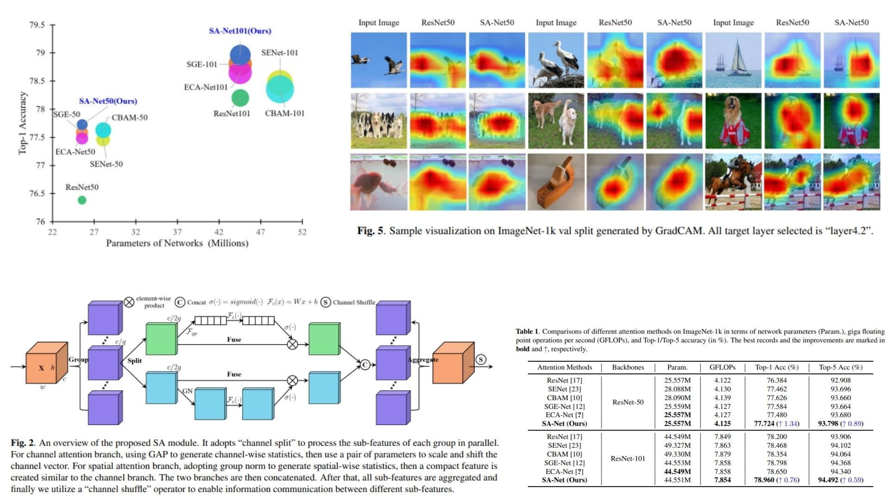

# 🐸 SA-Net-Replication – Shuffle Attention for CNNs

This repository provides a **PyTorch-based replication** of  
**SA-Net: Shuffle Attention for Deep Convolutional Neural Networks**.

The focus is **understanding and implementing shuffle attention modules** practically,  
rather than chasing benchmark SOTA results.

- Captures **long-range dependencies across channels and spatial locations** 🌊  
- Modular & **plug-and-play for any CNN backbone** 🔗  
- Lightweight & interpretable, ideal for **experimentation** 🧩  

**Paper reference:** [Qing-Long Zhang, Yu-Bin Yang, 2021](https://arxiv.org/pdf/2102.00240) 📄

---

## 🌠 Overview – SA-Net Pipeline



The core idea:

> For each sub-feature group, apply **channel attention** and **spatial attention** separately, then shuffle channels to enable inter-group information flow.

High-level procedure:

1. Extract feature map $X \in \mathbb{R}^{C \times H \times W}$ from a CNN backbone.  
2. Split channels into **G subgroups**:  
   $$x \rightarrow \text{chunk}(G)$$
3. Each subgroup → split into **channel branch** and **spatial branch**  
4. Apply channel attention:
$$X_c = X_0 \cdot \sigma(W_c \cdot \text{GAP}(X_0) + b_c)$$
5. Apply spatial attention:
$$X_s = X_1 \cdot \sigma(W_s \cdot \text{GN}(X_1) + b_s)$$
6. Concatenate branches and **shuffle channels**:  
$$X' = \mathtt{channel\_shuffle}([X_c, X_s], G)$$

The module can be inserted **after residual blocks** or at any intermediate CNN layer, and is fully **end-to-end trainable**.

---

## 🧮 Shuffle Attention – Math Essentials

For each input feature map $X$:

- **Channel Attention**:  
$$X_c = X_0 \cdot \sigma(W_c \cdot \text{GAP}(X_0) + b_c)$$

- **Spatial Attention**:  
$$X_s = X_1 \cdot \sigma(W_s \cdot \text{GN}(X_1) + b_s)$$

- **Concatenate & Shuffle**:  
$$X' = \mathtt{channel\_shuffle}([X_c, X_s], G)$$


Where:  
- $G$ = number of sub-feature groups  
- $W_c, b_c, W_s, b_s$ = trainable scaling & bias parameters  
- $\sigma$ = sigmoid activation  
- GAP = global average pooling  
- GN = group normalization  

This design efficiently captures **long-range dependencies** across both channels and spatial locations.

---

## 🧠 What the Module Does

- Models **long-range channel & spatial dependencies**  
- Flexible: can use **different number of groups G** depending on the backbone  
- Lightweight: adds minimal extra parameters  
- Fully **modular**, can attach to any CNN backbone

---

## 📦 Repository Structure

```bash
SA-Net-Replication/
├── src/
│   ├── layers/
│   │   ├── conv_layer.py          # Conv2d wrapper (1x1, 3x3)
│   │   ├── activation.py          # ReLU, Sigmoid helpers
│   │   └── normalization.py       # GroupNorm or LayerNorm helpers
│   │
│   ├── sa/
│   │   ├── sa_block_modular.py    # Shuffle Attention module (Fig.3)
│   │   ├── channel_attention.py   # Channel attention branch (GAP + sigmoid)
│   │   └── spatial_attention.py   # Spatial attention branch (GN + sigmoid)
│   │
│   ├── backbone/
│   │   └── resnet_blocks.py       # CNN block + optional SA insertion
│   │
│   ├── model/
│   │   └── sa_cnn.py              # Backbone + SA forward logic
│   │
│   └── config.py                  # G, channel split, SA positions, num_classes
│
├── images/
│   └── figmix.jpg                 # SA-Net overview figure
│
├── requirements.txt
└── README.md
```
---


## 🔗 Feedback

For questions or feedback, contact: [barkin.adiguzel@gmail.com](mailto:barkin.adiguzel@gmail.com)
